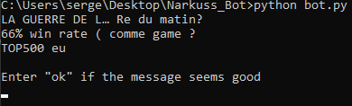
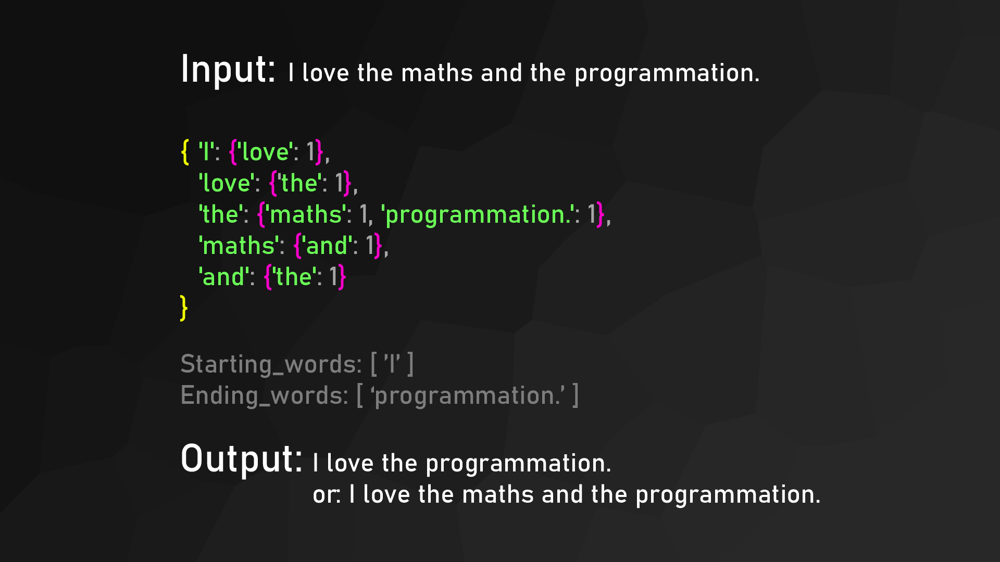
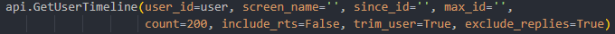
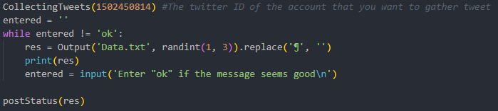
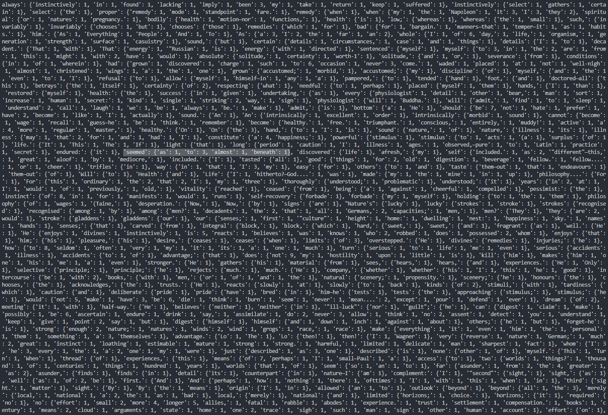

# TwitterMarkovBot
This is a twitter bot that collects data from an user, in order to tweet based on the Markov chain principle.

# How to use it ?

Pre Requirements: Python 3, **Python twitter**, ***an Twitter developper account***

First, put your [API keys](https://developer.twitter.com/en/apps/) and copy paste the different keys in the area made for it in the config.py file.

Then you have to [get the ID of the account](https://tweeterid.com/) that you want to gather tweets 
and put it in the bot.py file at the line 39.

Finaly just launch bot.py script by using a terminal.

# How does it work ?

First you should probably do some research on Markov chain, because it can be used in many different situation, and this project here is just one of the uses of it.

The example that i've picked below is really simple as i want to explain the principle of the Markov Chain, but you can use as much data as you want (as soon as your pc has enough performances to run the program). I've put a part of an huge dictionnary at the end.

## The input

### Gathering data

The Data Gathering part is really simple as we use the twitter API.

I use the function GetUserTimeLine in order to get all the tweets that the account has posted recently.

There is a lot of parameters that you can modify in this function but i won't explain everything as there is already a great documentation: 
-   `user_id` = The account's ID
-   `screen_name` = The name of the account
-   `count` = The number of tweets that you want to gather (max = 200)
-   `include_rts` = To get or not retweets
-   `exclude_replies` = To get or not replies 

This function return an array that contains all of the tweets that you gathered.

### Using the Markov Chain principle

A dictionnary is created based on the data that is gathered by the twitter API:
-   The keys of this dictionnary are each words used in the data
-   The values of these keys are an other dictionnary which contains:
    -   as key, the word that follows the word in the base dictionnary
    -   as value, the number of time that this word follows the word in the base dictionnary.

The starting words list contains the words that are after an ending ponctuation like ".", "!", "?", "..." And new : "¶" (it replaces the \n considering that people no longer use ponctuation nowadays).

The ending words list contains the words that are before an ending ponctuation like ".", "!", "?", "...", "¶".

## The output

The algorithm works like this:
-   Take an random word from the starting words
-   while word isn't an ending word:
    -   add a random word that follows the previous word to the sentence (but with probabilities ex: 'it': {'is': 2, 'looks': 1} → you have more chances to pick 'is' than to pick 'looks')
-   return the sentence

Furthermore, i've added a while loop in order to read the tweet before it is posted, and to select a generation that you prefer.
 
When the setence looks good/fun just type "ok" and the program will call the function `postStatus` that uses the PostUpdate function of the twitter API.

# Can i help you ?

Sure ! Don't hesitate to propose some upgrades by doing commits, i will make sure to tell you what i'm thinking about those changes.

# That's a lot of data !

